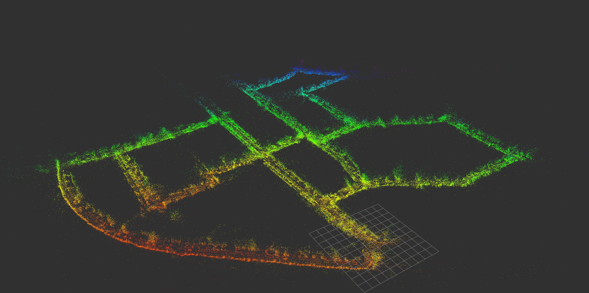
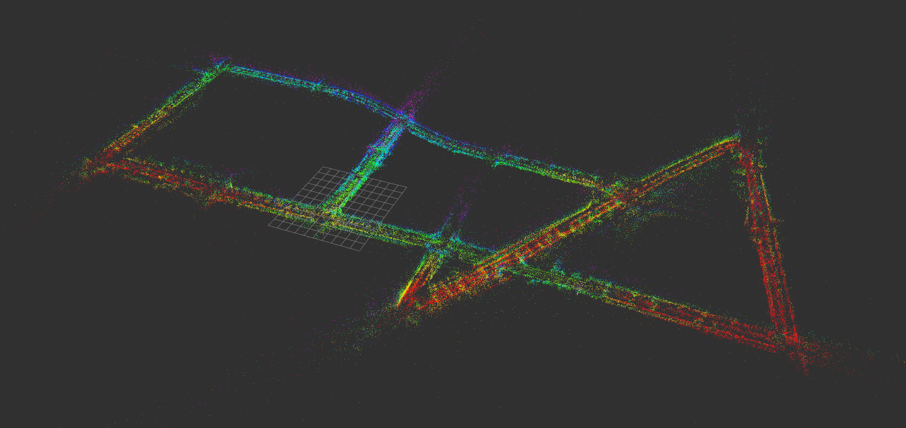
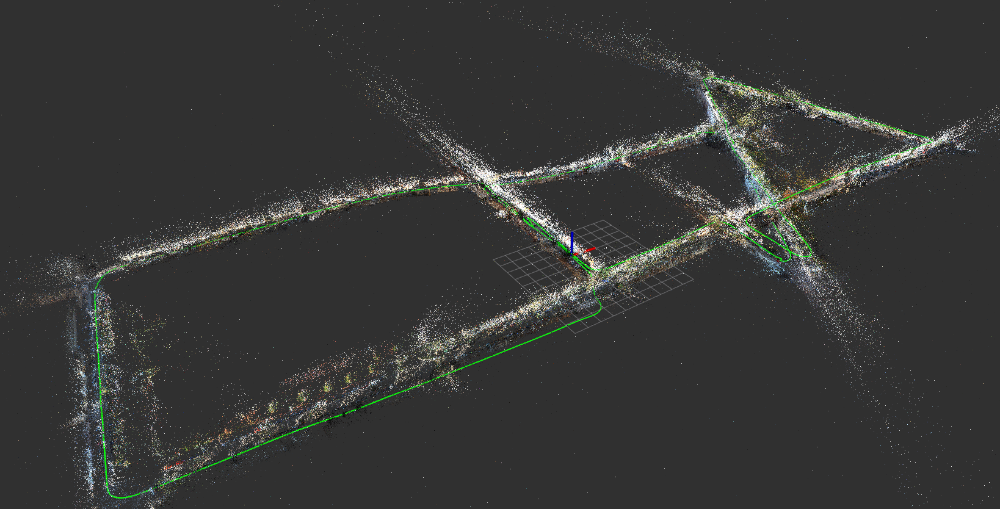

# ROS-SLAM
Simple barebones implementation of Stereo RGB SLAM system on KITTI dataset using custom Dense feature sampling and 3D-2D PnP localization, loop closure and g2o pose graph optimization.

**PS : i'm still working on this code so the codes may be subject to abrupt change**

Everything about this system is rather same as most SLAM systems except ive ditched feature detectors(ORB/SIFT/SURF etc) ad they often caused localization losses/siginficant drift in pose estimation or straight up slow even with multithreading. instead ive used a dense keypoint sampling method, to keep things simple.

ROS topics are published as :
1. Pose : `geometry_msgs::PoseStamped`
2. Trajectory : `nav_msgs::Path`
3. Map : `sensor_msgs::PointCloud2` published as ```pcl::PointCloud<pcl::PointXYZRGB>```

## Dependencies
1. OpenCV & OpenCV Contrib : https://github.com/opencv/opencv
2. PCL : https://github.com/PointCloudLibrary/pcl
3. g2o : https://github.com/RainerKuemmerle/g2o
4. DBoW2 & DUtils : https://github.com/dorian3d/DBoW2

And obviously ROS(duh).
## Compiling
You can compile this like any other ROS pkg, just clone it to catkin workspace and invoking the following from root catkin workspace.
```
catkin_make -j$((`nproc`-1))
source ./devel/setup.bash
```
## Executing
Make sure you edit the cpp file to point to the dataset in your machine:
```
./visualSLAM/src/VisualSLAM.cpp
```
and scroll to the main function to edit the paths.
In adition to the datasets, you also need to point to the ORB vocabulary file forDBoW2 loop closure detection(also in the same place as dataset path). ive already provided vocabulary files for Sequences 00, 08, 13. respectively.

Then recompile and run(make sure you got roscore running in another terminal) 
```
rosrun ros_slam visualSLAM
```
## Results
The semi dense keypoint tracking is done using Lucas Kanade tracking with RANSAC thresholding between frames *N-1* and *N* as standard matching isnt effective in dense keypoints and is shown as:


The pose estimation is not saved but ive written a lil function in `./visualSLAM/include/monoUtils.h` that can output the trajectory as a CSV file that can be viewed using Python and matplotlib as:


results can be viewed easily in rviz through the published topics. For example the results on sequence 13 of KITTI dataset:



Oh yeah also we publish ```pcl::PointCloud<pcl::PointXYZRGB>``` which means rviz can see the map in all its RGB Glory!..heres seq13 again



After mapping is done it can be saved as an RGB .ply file named map.ply, it can be viewed with any 3d rendering tool, heres a render in blender of KITTI sequence 00:


